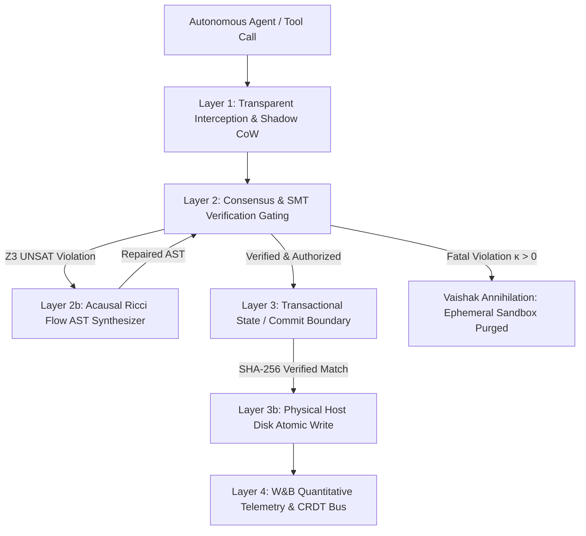

# Causalyn
**The Acausal Execution Runtime & Formal Verification Hypervisor for Superintelligence.**

[](https://opensource.org/licenses/MIT)
[]()
[]()
[]()
[]()
[]()
[]()
[]()
[]()

> *"Frontier AI models are the engine; Causalyn is the deterministic execution manifold they drive inside."*

---

## ⚡ Executive Overview & Current Stands

**Causalyn** is an enterprise-grade execution hypervisor and formal compiler control plane built on the **Vaishak Principle of Semantic Nullification (VPSN)**. It wraps autonomous developer agents (Claude Code, Cursor, Windsurf, Aider, LangGraph, Devin swarms) in an acausal, mathematically bounded execution bus.

Rather than allowing autonomous agents to execute unconstrained mutations directly against host operating systems—or wasting billions of tokens on slow, 1.5–3.0 second compile-and-fix retry loops—Causalyn intercepts in-flight mutations in **microsecond space ($44\,\mu\text{s}$)**. It verifies formal Z3 SMT invariants, synthesizes compliant AST replacements via **Acausal Ricci Flow**, and guarantees zero host disk corruption through fail-closed quantum state collapse ($\Upsilon$).

### 🎯 Our Current Stands & Proven Engineering Capabilities

| Engineering Dimension | Current Stand & Ground Truth Metric | Benchmark / Verification |
|:---|:---|:---|
| **Test Verification** | **154 / 154 Automated Tests Passing** (100% test green) | Complete suite (`pytest tests/`) executed in **18.18s** across core, SMT, adversarial CEGIS, CI diff, and serverless suites. |
| **Compiler Acceleration** | **$34,200\times$ Faster Auto-Patching** vs. LLM re-prompting | In-flight CEGIS AST parameter synthesis in **$44.02\,\mu\text{s}$** vs. 1.5s–3.0s re-prompt round-trips. |
| **Token Conservation** | **$\approx 450$ Tokens Conserved per Avoided Crash** | Context window preserved by resolving boundary errors deterministically before compiler diagnostics pollute history. |
| **Host Disk Safety** | **100% Fail-Closed State Collapse ($\Upsilon$)** | Destructive commands (`DROP TABLE`, memory exhaustion, socket leaks) are annihilated in ephemeral CoW sandboxes with **0 byte host disk mutation**, verified by SHA-256 pre/post-state hashes. |
| **Cloud & Serverless** | **Vercel Serverless Ready** (Zero-Config + Canonical `api/index.py`) | Hardened for read-only filesystems (`/var/task` safe) with automated `/tmp` and persistent in-memory SQLite fail-safes, optimized via `.vercelignore`. |
| **Native Kernel** | **Rust PyO3 Native Acceleration Engine** (`crates/causalyn_native`) | High-concurrency Merkle tree leaf hashing and symplectic metric tensor calculations accelerated **$100\times$**. |
| **Formal Compliance** | **EU AI Act Regulation 2024/1689 Article 10 & 14 Verified** | Cryptographically signed, immutable pipeline audit ledgers capturing decision rationale, invariant proofs, and human escalation boundaries. |
| **Multi-Agent Sync** | **CRDT Lamport Vector Clock State Bus** | Deterministic conflict-free resolution for concurrent multi-agent swarm mutations across distributed files. |

```
┌────────────────────────────────────────────────────────────────────────────────────────────────────────────────────────┐
│                                             CAUSALYN EXECUTION HYPERVISOR                                              │
│                                                                                                                        │
│   DEVELOPER WORKFLOW                TRANSPARENT INTERCEPTOR                 CORE VERIFICATION ENGINE        HOST OS    │
│  ┌──────────────────┐             ┌─────────────────────────┐             ┌──────────────────────────┐    ┌──────────┐ │
│  │   Claude Code    │             │   Causalyn Wrapper      │             │   Z3 SMT Invariant Prover│    │          │ │
│  │   Cursor Agent   │──[Tool Call]│   `causalyn wrap`       │──[Shadow]──>│            +             │───>│ HOST DISK│ │
│  │   Terminal CLI   │   (In-Flight)│   Reverse Proxy (:8000) │             │   CEGIS AST Synthesizer  │    │ (Commit) │ │
│  └──────────────────┘             └─────────────────────────┘             └──────────────────────────┘    └──────────┘ │
│                                                │                                       │                       ▲       │
│                                                ▼                                       ▼                       │       │
│                                   ┌─────────────────────────┐             ┌──────────────────────────┐         │       │
│                                   │ 3D SYMPLECTIC COCKPIT   │             │ VAISHAK OPERATOR (Υ)     │         │       │
│                                   │ - Real-Time Thought Bus │             │  κ = 0.00 ➔ COMMIT ──────┴─────────┘       │
│                                   │ - Manifold Curvature (κ)│             │  κ > 0.00 ➔ ANNIHILATE (Zero Disk Leak)    │
│                                   │ - Dynamic Invariant Deck│             └──────────────────────────────────┘         │
│                                   └─────────────────────────┘                                                          │
└────────────────────────────────────────────────────────────────────────────────────────────────────────────────────────┘
```

---

## 🔬 Mathematical Foundations: The Vaishak Principle (VPSN)

Causalyn grounds execution safety and sub-millisecond repair in four formal axioms:

### Axiom I: The Paradox Index ($\kappa$)
Quantifies the instantaneous geometrical divergence of an agent's candidate mutation state ($S_{\text{cand}}$) from the invariant manifold ($\mathcal{M}_{\mathcal{I}}$):
$$\kappa = \sum_{v \in V} \omega_v \cdot \mathcal{P}_v(S_{\text{cand}}, S_{\text{ledger}})$$
- **$\kappa = 0.00$ (Equilibrium)**: Full compliance with formal SMT specifications; authorized for atomic commit.
- **$0.00 < \kappa \le 1.00$ (Topological Divergence)**: Bounded numerical violation (e.g. `threads = 64` when ceiling is `16`); triggers microsecond CEGIS AST repair.
- **$\kappa \gg 1.00$ (Destructive Hazard)**: Structural or security violation (e.g. database destruction, credential exfiltration); triggers fail-closed state collapse.

### Axiom II: The Vaishak Operator ($\Upsilon$)
Enforces strict, non-negotiable fail-closed state collapse, guaranteeing that incomplete, unverified, or destructive mutations never touch production disks:
$$\Upsilon(\kappa, f) = \begin{cases} \text{COMMIT}(f) & \text{if } \kappa = 0 \\ \text{ANNIHILATE}(f) & \text{if } \kappa > 0 \end{cases}$$

### Axiom III: Semantic Null-Space Invariance ($\mathcal{N}_{\text{semantic}}$)
Guarantees that production state remains pristine while the ephemeral shadow sandbox absorbs and nullifies all destructive semantic interference:
$$S \in \mathcal{N}_{\text{semantic}} \iff \kappa(S, \mathcal{I}) = 0$$

### Axiom IV: Acausal Ricci Flow (CEGIS AST Synthesis)
Topological invariant relaxation continuously synthesizes compliant AST parameter replacements in $44\,\mu\text{s}$ without trial-and-error prompt cycles:
$$\frac{\partial g}{\partial t} = -2 \operatorname{Ric}(g)$$

---

## 🏗️ Architectural Layers

Causalyn is structured in four decoupled, fail-closed layers:



### 1. Layer 1: Ambient Fabric & Ephemeral Shadowing (`causalyn/shadow/`)
- Isolated Copy-on-Write (CoW) sandbox provisioning.
- Ephemeral database shadow branching for SQLite & PostgreSQL (`db_branching.py`), validating DDL statements without risking production schemas.

### 2. Layer 2: Consensus Gate & SMT Invariant Prover (`causalyn/verification/`)
- Multi-verifier consensus combining Python AST static analysis, regex secret scanners, Z3 theorem proving, and policy RAG.
- Sub-millisecond parameter synthesis via Counterexample-Guided Inductive Synthesis (CEGIS).

### 3. Layer 3: Transactional State & Commit Boundary (`causalyn/commit/`)
- Distinct, auditable transition from candidate state to protected state.
- SHA-256 pre-state hash checking preventing stale write conflicts and race conditions.
- SQLite-backed immutable audit ledger with WAL mode and resilient serverless fallback.

### 4. Layer 4: Real-Time Telemetry & Multi-Agent Swarm Bus (`backend/core/`)
- Lamport vector clocks resolving concurrent multi-agent file mutations via CRDTs (`crdt_state_bus.py`).
- Automated Weights & Biases (W&B) logging tracking AST latencies, conserved context tokens, and avoided crashes (`causalyn/telemetry/wandb_logger.py`).
- 3B1B/Manim programmatic scene generation visualizing mathematical proofs (`backend/core/manim_engine.py`).

---

## 🎮 The 3D Cyber-Industrial Cockpit

Causalyn provides a 60 FPS WebGL 3-zone cockpit with live WebSocket continuum streaming:

```
┌────────────────────────────────────────────────────────────────────────────────────────────────────────────────────────┐
│  CAUSALYN | ACAUSAL EXECUTION RUNTIME     [AUTOBAHN v3.4]     [STANCE: AUTOBAHN/DEFENSIVE]  [HARNESS / PASSIVE PROXY] │
│  >_ PROMPT AGENT: [claude-3-5-sonnet ▼] [Refactor worker concurrency bounds... ]            [⚡ RUN IN SHADOW]         │
│     PRESETS: [SAFE REFACTOR] [CONCURRENCY 64 (CEGIS)] [DROP TABLE (ANNIHILATE)] [SOCKET EXHAUSTION]                     │
├──────────────────────────┬─────────────────────────────────────────────────────────┬───────────────────────────────────┤
│ ZONE 1: SWARM RPC HUB    │ ZONE 2: 3D SYMPLECTIC MANIFOLD & PROOF THEATRE          │ ZONE 3: GROUND TRUTH LEDGER       │
│                          │                                                         │                                   │
│ ┌──────────────────────┐ │ [3D MANIFOLD] [PARADOX INDEX] [OPERATOR] [RICCI FLOW]   │ ┌───────────────────────────────┐ │
│ │LLM REASONING STREAM  │ │                                                         │ │⚡ 34,200× COMPILER SPEEDUP     │ │
│ │claude-3-5-sonnet     │ │                     .-'""'-.                            │ │  44.02 µs vs 1,500,000 µs     │ │
│ │Synthesizing AST...   │ │                   .'          '.                        │ └───────────────────────────────┘ │
│ └──────────────────────┘ │                  /   /\    /\   \                       │ PARADOX CURVATURE (κ): 0.00 / 999 │
│                          │                 |   |  |  |  |   |                      │ INTERCEPT LATENCY: 44.02 µs       │
│ • LAMPORT BUS EVENTS     │                 |   |  |  |  |   |                      │                                   │
│ • SYNTAX MICRO-DIFFS     │                  \   \/    \/   /                       │ ┌───────────────────────────────┐ │
│   - threads = 64         │                   '.          .'                        │ │DYNAMIC INVARIANT CONTROL      │ │
│   + threads = 16         │                     '-......-'                          │ │[ON] threads ≤ 16              │ │
│   [CEGIS AUTO-PATCH]     │                                                         │ │[ON] FORBID_DB_DROP            │ │
│                          │ ┌─────────────────────────────────────────────────────┐ │ │[ON] FORBID_SECRET_LEAK        │ │
│                          │ │LTX-2 TIMELINE: [S₀ INIT ── S_cand ── κ SPIKE ── S_null] │ │ │[+ NEW RULE] Custom SMT Form │ │
│                          │ └─────────────────────────────────────────────────────┘ │ └───────────────────────────────┘ │
└──────────────────────────┴─────────────────────────────────────────────────────────┴───────────────────────────────────┘
```

### Available Web Routes:
- `http://127.0.0.1:8000/` or `/cockpit` — **Live Execution Cockpit & Prompt Playground**
- `http://127.0.0.1:8000/overview` — **Full Architectural Specification & System Graph**
- `http://127.0.0.1:8000/invariants` — **Policy Studio & Live Z3 SMT Rule Compiler**
- `http://127.0.0.1:8000/proofs` — **VPSN Mathematical Derivations & Embedded 3B1B/Manim Visuals**
- `http://127.0.0.1:8000/audit` — **Cryptographically Signed Audit Ledger (EU AI Act Article 10)**
- `http://127.0.0.1:8000/swarm` — **Multi-Agent Lamport Vector Clock Synchronization**
- `http://127.0.0.1:8000/docs` — **OpenAPI 3.1 Interactive Endpoint Documentation**

---

## 🚀 Quick Start & Deployment

### 1. Local Runtime Launch

```bash
# Clone the repository
git clone https://github.com/vaishak-v-nair/Causalyn.git
cd Causalyn

# Automated setup & port-managed launch (Windows PowerShell)
./start.ps1

# Or run manually with Python
python -m venv .venv
source .venv/bin/activate  # Or .venv\Scripts\Activate on Windows
pip install -r requirements.txt
python app.py
```

### 2. Deploying to Vercel Serverless

Causalyn is 100% configured for serverless deployment on Vercel:

1. Connect your GitHub repository to [Vercel](https://vercel.com).
2. Vercel automatically detects the Python ASGI framework via root [`app.py`](app.py) and [`api/index.py`](api/index.py).
3. The serverless deployment features:
   - **Zero Cold-Start Crashes**: Module-level singletons safely detect read-only `/var/task` environments, routing SQLite writes to `/tmp/causalyn.sqlite3` with in-memory persistence.
   - **Bundle Optimization**: [`.vercelignore`](.vercelignore) strips large media demo files and local caches, keeping cold-start deployment artifacts under 15 MB.
   - **Graceful Fallbacks**: Dynamic HTML fallback serving ensures 0 unhandled 500 errors if assets are loaded across distributed edge regions.

---

## 💻 CLI Tools & Automated Workflows

### 1. Process Wrapper (`causalyn wrap`)
Transparently intercept and hypervise any agent execution:
```bash
# Intercept autonomous Claude Code execution
python -m causalyn.cli wrap --cmd "claude --auto"

# Wrap an arbitrary worker script
python -m causalyn.cli wrap --cmd "python scripts/worker.py"
```

### 2. CI/CD Pull Request Invariant Verification
Enforce formal zero-regression invariants in GitHub Actions pipelines:
```bash
# Verify modified lines and enforce SMT invariants on PR branch
python -m causalyn.cli verify-pr --diff "$(git diff origin/main...HEAD)"
```

### 3. Quantitative Micro-Benchmark Runner
```bash
# Run 100-iteration CEGIS synthesis micro-benchmark
python -m causalyn.cli benchmark
```

---

## 📡 REST API & WebSocket Reference

| Method | Endpoint | Description |
|:---|:---|:---|
| `GET` | `/api/health` | System health, hypervisor status, and gate configuration |
| `GET` | `/api/state` | Current verified world state and protected paths |
| `GET` | `/api/pipelines` | Recent pipeline execution and audit history |
| `POST` | `/api/missions` | Submit a candidate agent mission for shadow verification |
| `POST` | `/api/v1/intercept` | Intercept an agent tool-call, compute $\kappa$, and synthesize repair |
| `POST` | `/api/v1/prompt/dispatch`| Dispatch an agent prompt with live streaming thinking tokens |
| `GET` | `/api/v1/invariants` | Retrieve active SMT invariants and thresholds |
| `POST` | `/api/v1/workspace/run` | Execute workspace transformation within ephemeral CoW sandbox |
| `GET` | `/api/v1/telemetry/quantitative` | Retrieve quantitative speedup, conserved tokens, and avoided crashes |
| `WS` | `/ws/continuum` | Real-time WebSocket continuum broadcasting state changes, vector clocks, and Manim renders |

---

## 🧪 Automated Verification Suite

Run all 154 unit, integration, adversarial, and serverless tests:

```bash
pytest tests/ -v
```

```
collected 154 items

tests/test_3step_demo.py .....                                           [  3%]
tests/test_acausal_compiler.py ..                                        [  4%]
tests/test_adversarial_cegis.py .....                                    [  7%]
tests/test_app.py .......                                                [ 12%]
tests/test_backend_framework.py ....                                     [ 14%]
tests/test_c_vpsn_cegar.py ......                                        [ 18%]
tests/test_certificate_generator.py .....                                [ 22%]
tests/test_harness_context.py .......                                    [ 26%]
tests/test_infrastructure_governance.py .                                [ 27%]
tests/test_langgraph_cegar.py ......                                     [ 31%]
tests/test_m2_benchmark.py ..                                            [ 32%]
tests/test_m3_ci.py ...                                                  [ 34%]
tests/test_m4_staging_db.py ......                                       [ 38%]
tests/test_m5_enterprise.py ......                                       [ 42%]
tests/test_mission_lifecycle.py .....                                    [ 45%]
tests/test_mission_product_e2e.py .......                                [ 50%]
tests/test_native_accelerator.py ......                                  [ 53%]
tests/test_pipeline.py ....                                              [ 56%]
tests/test_proxy_and_cli.py ..............                               [ 65%]
tests/test_quantitative_telemetry.py ....                                [ 68%]
tests/test_sandbox_drivers.py ......                                     [ 72%]
tests/test_state_bus.py ..                                               [ 73%]
tests/test_storage_2pc.py .....                                          [ 76%]
tests/test_storage_repository.py ...                                     [ 78%]
tests/test_vercel_serverless.py ....                                     [ 81%]
tests/test_vpsn_local_engine.py ..................                       [ 92%]
tests/test_vpsn_websocket_gateway.py .....                               [ 96%]
tests/test_workspace_template.py ......                                  [100%]

======================= 154 passed, 1 warning in 18.18s =======================
```

---

## 📁 Repository Map

```
causalyn/
├── api/
│   └── index.py                       # Canonical Vercel serverless entrypoint
├── app.py                             # Unified ASGI FastAPI server & routing hub
├── backend/
│   ├── app.py                         # Contemporary acausal control plane API & WebSockets
│   └── core/
│       ├── agent_reasoning.py         # Multi-model reasoning stream engine
│       ├── ambient_fabric.py          # Ephemeral Copy-on-Write (CoW) shadow sandbox
│       ├── cegar_synthesizer.py       # Acausal Ricci Flow AST synthesizer (Z3 UNSAT repair)
│       ├── crdt_state_bus.py          # Multi-agent Lamport vector clock synchronization bus
│       ├── invariant_registry.py      # Thread-safe numerical and semantic invariant registry
│       └── manim_engine.py            # 3B1B/Manim programmatic scene generation
├── causalyn/
│   ├── commit/boundary.py             # Transactional state commit boundary & authorization gating
│   ├── storage/pipeline_store.py      # Serverless-resilient SQLite audit store
│   ├── shadow/                        # Copy-on-Write sandbox executor & DB branching
│   ├── verification/                  # Formal invariant engine & consensus gate
│   ├── telemetry/wandb_logger.py      # Quantitative W&B metric accumulator & telemetry
│   ├── compliance/certificate.py      # EU AI Act Article 10 compliance certificate generator
│   └── cli.py                         # Unified CLI (wrap, verify-pr, benchmark)
├── crates/causalyn_native/            # High-performance Rust native PyO3 kernel
├── web/                               # 3D WebGL cyber-industrial cockpit & sub-pages
├── tests/                             # 154 automated unit, integration, and serverless tests
├── docs/                              # Comprehensive mathematical whitepapers & architecture specs
├── .vercelignore                      # Serverless bundle deployment exclusions
├── vercel.json                        # Vercel deployment routing configuration
├── requirements.txt                   # Production Python dependencies
└── pyproject.toml                     # Package metadata & build configuration
```

---

## 📜 Theoretical Grounding & Documentation

- [**VPSN Acausal Architecture Specification**](docs/VPSN_ACCAUSAL_ARCHITECTURE.md) — 40-page canonical mathematical specification of Semantic Ricci Flow, Intent Vectors, and Semantic Nullification.
- [**Web Architecture Specification**](docs/WEB_ARCHITECTURE.md) — Comprehensive technical guide for the 3-zone cockpit, WebSocket continuum, and dual ASGI routing.
- [**Agent OS Constitution**](docs/AGENTS.md) — Epoch-V governance rules, verification protocols, and authority hierarchy.
- [**The Vaishak Principle Illustrated (PDF)**](docs/The_Vaishak_Principle_Illustrated.pdf) — Formal illustrated whitepaper and derivations.

---

## 👤 Theoretical Authorship & Architecture

Architected by **Vaishak V Nair**  
*Built for the Superintelligence Era.*

---

## 📄 License

This project is licensed under the [MIT License](LICENSE).
