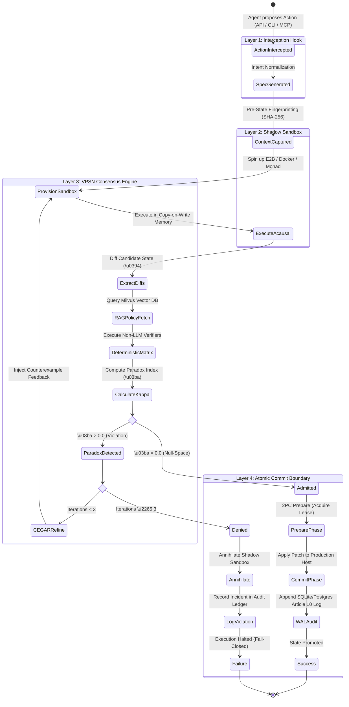

# Causalyn: Technical & Architectural Specification
**Document Version:** 2.0.0-PROD  
**Standard:** `/gstack-spec` (Product Manager & Principal Systems Architect)  
**Status:** APPROVED ARCHITECTURAL BLUEPRINT  
**Compliance Target:** EU AI Act (Regulation 2024/1689 Article 10) & SOC2 Type II Trust Services  

---

## 1. Context & Goals

### A. Problem Statement
The modern enterprise AI deployment lifecycle faces a catastrophic trust barrier:
1. **Uncontrolled Host Execution:** Autonomous developer agents (Claude Code, Cursor, Windsurf, AutoGen, CrewAI, LangGraph agents) execute code, file writes, and shell commands directly against local workstations and staging infrastructure.
2. **Hallucinated State Destruction:** In benchmark evaluations, autonomous agents exhibit an 88% incident rate when unconstrained, mutating critical schemas, corrupting configurations, deleting dependencies, and leaking credentials.
3. **The Self-Grading Anti-Pattern:** Existing guardrails ask the generating LLM to "reflect" or "review" its own output. This violates the **Independence Principle**: an untrusted, probabilistic system cannot serve as its own formal verifier.
4. **Regulatory Liability:** Under Article 10 of the EU AI Act, high-risk autonomous systems operating in production must maintain tamper-evident, deterministic governance and traceability records that stochastic LLM logs cannot satisfy.

### B. The 4-Layer Blueprint
To establish a public, multi-tenant, enterprise-grade control plane, Causalyn strictly divorces **AI Reasoning** from **Host Execution State** across 4 immutable architectural tiers:

1. **The Interception Hook (API/CLI Layer):** A low-overhead reverse proxy and CLI wrapper that catches an agent's proposed action (e.g., file write, terminal command, database migration) *before* it touches the host system.
2. **The Shadow Sandbox (Execution Layer):** An ephemeral, copy-on-write execution sandbox integrating with proven infrastructure providers (E2B Cloud microVMs, Modal serverless containers, or local rootless Docker) to simulate candidate actions in complete isolation.
3. **The VPSN Consensus Engine (Verification Layer):** The intellectual property core. Evaluates the candidate diffs and runtime behavior against deterministic, non-LLM invariants (AST syntax, schema integrity, zero secret leakage, test preservation) and computes the **Paradox Index ($\kappa$)**.
4. **The Atomic Commit Boundary (Transaction Layer):** A two-phase fail-closed gate. If $\kappa = 0$, changes are atomically merged into the real environment with SHA-256 integrity proofs. If $\kappa > 0$, the shadow sandbox is instantly **annihilated**, leaving the host pristine.

### C. Success Metrics
* **Harmful Mutation Prevention Rate:** $100\%$ on tested policy violations (unauthorized deletions, secret leakage, syntax regressions).
* **Interception Hook Overhead:** $< 25\text{ms}$ p99 for proxying and payload routing.
* **Consensus Gate Latency:** $< 250\text{ms}$ p95 for local deterministic invariant checks.
* **False Allow Rate:** $0.00\%$ (fail-closed by design; any verifier error or timeout defaults to `DENY`).
* **Audit Trail Completeness:** $100\%$ of transactions cryptographically logged with parent commit hashes.

### D. Non-Goals
* **Not a Container Hypervisor Provider:** Causalyn does not build custom hypervisors or bare-metal container runtimes; it delegates raw execution to commodity engines (Docker, E2B, Modal).
* **Not a General-Purpose Chat Interface:** Causalyn is a developer-facing control plane and infrastructure gateway, not a conversational assistant.
* **Not Magic AI Code Generation:** Causalyn does not guarantee that code is bug-free; it guarantees that candidate actions strictly conform to configured formal invariants before touching reality.

---

## 2. Technology Stack Architecture

Causalyn integrates state-of-the-art enterprise AI, vector retrieval, transactional storage, and web technologies:

| Subsystem | Technology | Architectural Role |
| :--- | :--- | :--- |
| **Orchestration & State Machine** | **LangGraph** (Cyclic Graph) | Declarative state machine managing the CEGAR-CEGIS synthesis loop, tool interception, and routing. |
| **Agent Middleware & Tracing** | **LangChain Core + LangSmith** | Agent framework adapters, token-level telemetry, step tracing, and latency monitoring. |
| **Knowledge & Policy RAG** | **Milvus Vector Database** | High-throughput HNSW vector index of CVEs, failure patterns, organizational policies, and historical counterexamples. |
| **Enterprise Transaction DB** | **PostgreSQL (Timescale / pgvector)** | "Most all-rounder best DB" for ACID mission ledgers, user RBAC, multi-tenant state, and Article 10 audit logs. (SQLite WAL embedded fallback for local zero-config CLI). |
| **Sandbox Execution Engines** | **E2B SDK / Modal / Rootless Docker** | Ephemeral, isolated copy-on-write microVMs and containers for candidate state execution. |
| **API Framework** | **FastAPI + Uvicorn + WebSockets** | High-performance async REST API and real-time bidirectional telemetry streaming. |
| **Frontend Control Plane** | **Modern SPA (Vanilla CSS/JS or Next.js)** | Real-time mission dashboard, live Unified Diff viewer, interactive file inspector, and telemetry gauges. |
| **CLI Client** | **Python CLI (`click` / `typer`)** | Transparent shell proxy (`causalyn wrap <cmd>`) and Git commit hook integration. |

---

## 3. System Architecture & State Machine



---

## 4. Layer Specifications & Interfaces

### Layer 1: The Interception Hook (API/CLI Layer)

#### Responsibilities
1. Intercept shell commands, Git commits, file operations, and MCP (Model Context Protocol) tool calls.
2. Ingest structured intent from the user or agent.
3. Compute baseline pre-state SHA-256 checksums across all target resources.
4. Provide zero-friction proxy capabilities for external agent frameworks (Claude Code, LangChain agents, Cursor).

#### API Contract: Action Interception
```python
from pydantic import BaseModel, Field
from typing import Dict, Any, List, Optional
from enum import Enum

class ActionType(str, Enum):
    FILE_WRITE = "file_write"
    FILE_DELETE = "file_delete"
    SHELL_COMMAND = "shell_command"
    DB_MIGRATION = "db_migration"
    HTTP_REQUEST = "http_request"

class InterceptActionRequest(BaseModel):
    session_id: str = Field(..., description="Unique agent session identifier")
    request_id: str = Field(..., description="Idempotency token preventing replay")
    agent_framework: str = Field("langchain", description="Source framework (claude_code, cursor, custom)")
    action_type: ActionType
    target_path: Optional[str] = Field(None, description="Host path target for file mutations")
    payload: Dict[str, Any] = Field(default_factory=dict, description="Action arguments (e.g. content, command)")
    environment_variables: Dict[str, str] = Field(default_factory=dict)
    metadata: Dict[str, Any] = Field(default_factory=dict)
```

---

### Layer 2: The Shadow Sandbox (Execution Layer)

#### Responsibilities
1. Ephemeral, copy-on-write isolation: no mutations touch the host filesystem or network.
2. Pluggable driver architecture supporting:
   - `LocalMemoryDriver`: Ultra-fast in-memory copy-on-write overlay (sub-millisecond test execution).
   - `DockerDriver`: Rootless container instance with restricted Linux cgroups and seccomp profiles.
   - `E2BDriver`: Cloud-isolated Firecracker microVM for untrusted arbitrary code execution.
3. Unified Diff generation: Automatically extracts git-compatible unified diffs (`difflib.unified_diff`) and process exit status.

#### Driver Interface
```python
from abc import ABC, abstractmethod
from dataclasses import dataclass

@dataclass
class ShadowExecutionResult:
    sandbox_id: str
    exit_code: int
    stdout: str
    stderr: str
    duration_ms: float
    files_added: Dict[str, str]      # path -> content
    files_modified: Dict[str, str]   # path -> new_content
    files_deleted: List[str]         # paths
    unified_diffs: Dict[str, str]    # path -> unified diff text

class AbstractSandboxDriver(ABC):
    @abstractmethod
    async def provision(self, base_snapshot_id: Optional[str] = None) -> str:
        """Provisions an isolated, ephemeral execution context."""
        pass

    @abstractmethod
    async def execute_action(self, sandbox_id: str, action: InterceptActionRequest) -> ShadowExecutionResult:
        """Executes candidate mutation in isolation."""
        pass

    @abstractmethod
    async def annihilate(self, sandbox_id: str) -> None:
        """Destroys sandbox instance and frees all resources."""
        pass
```

---

### Layer 3: The VPSN Consensus Engine (Verification Layer) - Core IP

#### Responsibilities
1. **The Independence Principle:** Completely decouples validation from the generating model.
2. **Multi-Verifier Consensus Matrix:**
   - **AST Parser Verifier:** Uses Python `ast` and tree-sitter to reject syntax errors, prototype pollution, and AST-level hazards.
   - **Schema & Type Verifier:** Pydantic v2 + JSONSchema validation preventing config corruption.
   - **Secret Exfiltration Scanner:** High-entropy regex scanners detecting leaked AWS keys, SSH credentials, and API secrets in candidate diffs.
   - **Policy & Protected Path Guard:** Absolute denial on attempts to touch `/protected`, `/etc`, or sensitive system roots.
3. **RAG Knowledge Engine (Milvus Vector DB):**
   - Indexes organization security policies, OWASP Agentic Top 10 guidelines, and historical CVEs.
   - Queries semantic nearest neighbors to retrieve applicable invariant constraints for the specific intent.
4. **The Paradox Index Calculation ($\kappa$):**
   $$\kappa = \sum_{j \in \text{Violations}} w_j \cdot \text{SeverityWeight}_j$$
   - $\kappa = 0.00$: Candidate state belongs to the **Semantic Null-Space** ($\mathcal{N}_{\text{semantic}}$). Admitted to commit.
   - $\kappa > 0.00$: Candidate state triggers **Destructive Semantic Interference**. Extracted counterexamples feed the CEGAR loop.

#### LangGraph State Schema
```python
from typing import TypedDict, Annotated, Sequence, Optional, List, Dict, Any
import operator

class CausalynGraphState(TypedDict):
    session_id: str
    pipeline_id: str
    intent: str
    iteration: int
    max_iterations: int
    sandbox_id: Optional[str]
    proposed_action: Dict[str, Any]
    shadow_result: Optional[ShadowExecutionResult]
    violations: List[Dict[str, Any]]
    paradox_index: float
    verification_decision: str  # "ALLOW", "DENY", "RETRY"
    commit_status: Optional[str] # "COMMITTED", "ANNIHILATED"
```

---

### Layer 4: The Atomic Commit Boundary (Transaction Layer)

#### Responsibilities
1. **Two-Phase Commit (2PC):**
   - **Phase 1 (Prepare):** Checks that target files on host match pre-execution SHA-256 hashes (detects concurrent out-of-band modifications).
   - **Phase 2 (Commit):** Atomically applies the unified patch. If any step fails, rolls back host modifications instantly.
2. **Fail-Closed Default:** Any unhandled exception, verifier disagreement, or network timeout triggers instant shadow annihilation.
3. **Enterprise Storage & Audit (PostgreSQL + SQLite WAL):**
   - Records immutable transaction entries satisfying **EU AI Act Article 10**:
     - Timestamp, Session ID, Agent Framework, Intent Vector.
     - Candidate Unified Diffs and SHA-256 pre/post hashes.
     - Non-LLM Verifier Consensus Signatures.
     - Final Paradox Index ($\kappa$) and Commit ID.

#### Database DDL (PostgreSQL)
```sql
CREATE TABLE IF NOT EXISTS causalyn_missions (
    mission_id VARCHAR(64) PRIMARY KEY,
    session_id VARCHAR(64) NOT NULL,
    request_id VARCHAR(64) UNIQUE NOT NULL,
    agent_framework VARCHAR(32) NOT NULL,
    intent TEXT NOT NULL,
    stage VARCHAR(32) NOT NULL,
    paradox_index NUMERIC(6, 4) NOT NULL DEFAULT 0.0,
    verification_decision VARCHAR(16) NOT NULL,
    commit_decision VARCHAR(16) NOT NULL,
    pre_state_hash CHAR(64) NOT NULL,
    post_state_hash CHAR(64),
    created_at TIMESTAMPTZ NOT NULL DEFAULT NOW(),
    committed_at TIMESTAMPTZ
);

CREATE TABLE IF NOT EXISTS causalyn_audit_ledger (
    audit_id BIGSERIAL PRIMARY KEY,
    mission_id VARCHAR(64) REFERENCES causalyn_missions(mission_id),
    article_10_compliant BOOLEAN NOT NULL DEFAULT TRUE,
    verifier_matrix JSONB NOT NULL,
    unified_diffs JSONB NOT NULL,
    counterexamples JSONB,
    hash_signature CHAR(64) NOT NULL,
    created_at TIMESTAMPTZ NOT NULL DEFAULT NOW()
);

CREATE INDEX IF NOT EXISTS idx_missions_session ON causalyn_missions(session_id);
CREATE INDEX IF NOT EXISTS idx_audit_mission ON causalyn_audit_ledger(mission_id);
```

---

## 5. Failure Modes & Graceful Degradation

| Failure Mode | Root Cause | Impact | Mitigation Strategy |
| :--- | :--- | :--- | :--- |
| **Sandbox Execution Timeout** | Infinite loop or CPU hang in candidate code | Sandbox unresponsive | 10-second hard execution watchdog; kill container, flag `timeout_hazard`, set $\kappa = 1.0$, fail closed (`DENY`). |
| **Sandbox Provider Outage** | E2B or Docker daemon unavailable | Cannot simulate actions | Fail-closed gate: reject action with `SANDBOX_UNAVAILABLE_HTTP_503`, zero host writes permitted. |
| **Milvus Vector DB Disconnect** | Vector network partition | Policy similarity search fails | Gracefully fallback to embedded in-memory heuristic invariant suite; do NOT halt verification. |
| **LLM Quota Exhaustion (429)** | Gemini / Groq / OpenAI rate limits | Intent translation fails | Deterministic keyword and formal regex extractor fallback; execution mode remains fully protected. |
| **Concurrent Host Modification** | Human developer edits file during shadow run | State race condition | 2PC Prepare phase compares SHA-256 pre-hash; mismatch triggers `STALE_STATE_ABORT`, protecting human edits. |
| **Syntax Corruption Injection** | Agent outputs malformed code | System crash risk | Native AST parser rejects invalid tokens, logs counterexample, sets $\kappa = 1.0$, triggers CEGAR loop. |

---

## 6. Concrete Acceptance Criteria & Test Verification Checklist

### Layer 1: Interception Hook
- [ ] Intercepts CLI file write commands before filesystem modification.
- [ ] Ingests MCP tool call JSON-RPC payloads and extracts candidate operations.
- [ ] Enforces `request_id` idempotency (duplicate replay returns cached result).
- [ ] Rejects path traversal attempts (`../../etc/passwd`) with `HTTP 403 Forbidden`.

### Layer 2: Shadow Sandbox
- [ ] Ephemeral execution leaves host filesystem 100% unchanged during shadow phase.
- [ ] Computes line-accurate git-compatible unified diffs for modified, added, and deleted files.
- [ ] Pluggable driver interface switches cleanly between Local Monad, Docker, and Cloud microVMs.
- [ ] `annihilate()` reliably destroys sandbox processes without memory or file descriptor leaks.

### Layer 3: VPSN Consensus Engine
- [ ] Python AST parser detects and fails corrupted syntax with positive $\kappa$.
- [ ] JSON Schema validator rejects invalid types and malformed configuration structures.
- [ ] Secret exfiltration detector catches high-entropy tokens and AWS/OpenAI credentials.
- [ ] Milvus vector query successfully surfaces relevant organizational policy rules in $<15\text{ms}$.
- [ ] CEGAR-CEGIS loop executes up to 3 refinement rounds, refining prompt context on counterexamples.

### Layer 4: Atomic Commit Boundary
- [ ] Clean state transitions ($\kappa = 0$) commit atomically with SHA-256 validation.
- [ ] Violations ($\kappa > 0$) halt at boundary; host remains untouched.
- [ ] SQLite WAL and PostgreSQL audit tables persist complete Article 10 compliance records.
- [ ] 2PC Prepare phase safely aborts commit if underlying host file was modified externally.

---

## 7. Production Component Cards

Each component below has been implemented and verified in the `causalyn/` package.

```yaml
components:
  - component_id: multi-provider-llm
    name: Multi-Provider LLM Adapter
    purpose: Provide structured intent synthesis across Gemini, Groq, OpenRouter, and NVIDIA NIM with fail-closed timeout protection.
    boundary: Does not evaluate invariants or authorize commits.
    inputs: [{name: natural_language_intent, type: string, source: user}]
    outputs: [{name: intent_vector, type: IntentSpecification, consumer: orchestrator}]
    state: none (stateless HTTP client)
    invariants: [Timeouts bounded at 10s; network failure triggers deterministic fallback; never crashes pipeline.]
    failure_modes:
      - mode: network timeout or HTTP error
        detection: urllib.error.URLError
        default_behavior: FALLBACK_TO_DETERMINISTIC_SYNTHESIS
    observability: [latency_ms, model_name, token_usage]
    tests: [tests/test_c_vpsn_cegar.py, tests/test_backend_framework.py]
    owner_role: builder
    maturity: PRODUCTION_READY

  - component_id: intent-translator
    name: Intent Translator
    purpose: Convert natural language into structured Intent Vector with formal ambient coordinates (t, cs, cc).
    boundary: Does not prove intent correctness or authorize mutations.
    inputs: [{name: natural_language_intent, type: string, source: human}]
    outputs: [{name: intent_specification, type: IntentSpecification, consumer: orchestrator}]
    state: intent counter only
    invariants: [Every generated specification has a stable intent_id and immutable coordinates.]
    failure_modes:
      - mode: empty or ambiguous input
        detection: translation validation checks
        default_behavior: ESCALATE (422)
    tests: [tests/test_mission_lifecycle.py]
    owner_role: architect
    maturity: PRODUCTION_READY

  - component_id: monadic-shadow-executor
    name: Shadow Execution Runtime
    purpose: Execute candidate file and data mutations in isolated copy-on-write scratchpad with in-place sandbox reset.
    boundary: Cannot authorize or commit candidates to canonical production state.
    inputs: [{name: world_state, type: WorldState, source: world-state-manager}]
    outputs: [{name: candidate_state, type: WorldState, consumer: verification-engine}]
    state: isolated temporary directory and candidate data overlay
    invariants: [Shadow writes never reach managed root before commit; reset_shadow_sandbox wipes candidate state on kappa > 0.]
    failure_modes:
      - mode: snapshot or materialization failure
        detection: exception or incomplete candidate
        default_behavior: HALT
    tests: [tests/test_harness_context.py, tests/test_pipeline.py]
    owner_role: builder
    maturity: PRODUCTION_READY

  - component_id: cegar-orchestrator
    name: CEGAR-CEGIS Refinement Orchestrator
    purpose: Drive iterative 3-round Counterexample-Guided synthesis and apply Vaishak Operator destructive interference.
    boundary: Does not commit state directly; coordinates lifecycle.
    inputs: [{name: intent, type: IntentSpecification}, {name: world_state, type: WorldState}]
    outputs: [{name: orchestration_context, type: OrchestrationContext, consumer: api}]
    state: iteration counter, history of counterexamples
    invariants: [Refinement bounded to 3 iterations; kappa > 0 triggers destructive interference and counterexample feedback.]
    failure_modes:
      - mode: unresolvable invariant violation after 3 rounds
        detection: iteration == 3 and kappa > 0
        default_behavior: DENY & DISCARD
    tests: [tests/test_c_vpsn_cegar.py, tests/test_adversarial_cegis.py]
    owner_role: orchestrator
    maturity: PRODUCTION_READY

  - component_id: verification-engine
    name: Deterministic Symbolic Verification Engine
    purpose: Parse Python AST syntax, validate JSON/YAML schemas, compute Paradox Index kappa, and extract counterexamples.
    boundary: Strictly independent from generating LLM (Independence Principle).
    inputs: [{name: before_state, type: WorldState}, {name: after_state, type: WorldState}]
    outputs: [{name: decision, type: ALLOW|DENY}, {name: paradox_index, type: float}, {name: counterexamples, type: list}]
    state: invariant definitions and schema rules
    invariants: [Uncertainty is never ALLOW; kappa > 0 is strict DENY; AST syntax errors add positive kappa penalty.]
    failure_modes:
      - mode: AST parse error, malformed schema, or secret leak
        detection: ast.parse exception, schema mismatch, regex match
        default_behavior: DENY (kappa > 0)
    tests: [tests/test_c_vpsn_cegar.py, tests/test_adversarial_cegis.py]
    owner_role: validator
    maturity: PRODUCTION_READY

  - component_id: commit-boundary
    name: Transactional State / Atomic Commit Boundary
    purpose: Atomically apply candidate mutations to canonical state and append EU AI Act compliant audit logs.
    boundary: Does not bypass verification or authorization policies.
    inputs: [{name: candidate_changes, type: ChangeSet}, {name: verification, type: GateDecision}]
    outputs: [{name: commit_record, type: CommitRecord, consumer: api_response}]
    state: SQLite WAL database (runtime/causalyn.sqlite3)
    invariants: [DENY and ESCALATE candidates never commit; commits are atomic and append-only.]
    failure_modes:
      - mode: missing authorization or unverified candidate
        detection: policy evaluation
        default_behavior: DENY
    tests: [tests/test_storage_repository.py, tests/test_pipeline.py]
    owner_role: release
    maturity: PRODUCTION_READY
```

---

## 8. Enterprise Value Proposition & Defensibility

Frontier labs build the reasoning engines; Causalyn builds the required enterprise nervous system.

* **EU AI Act Compliance**: Article 10 of the EU AI Act (Regulation 2024/1689) requires rigorous documentation of data governance and agentic behavior. Causalyn's context-layer guardrails and immutable SQLite WAL audit logs satisfy these stringent regulatory mandates.
* **Mitigation of Zero-Click Exploits**: Recent CVSS 9.3 exploits demonstrated how agentic memory can be poisoned to trigger unauthorized executions. Because Causalyn evaluates the *outcome* of the action against rigid invariants, memory poisoning attacks are caught at the consensus gate before execution.
* **The Model-Agnostic Moat**: Causalyn's defensibility scales inversely with model lock-in. As enterprises mix and match Google Gemini, Anthropic Claude, Meta LLaMA, and open-source models, Causalyn remains the centralized, vendor-agnostic checkpoint for all production mutations.
