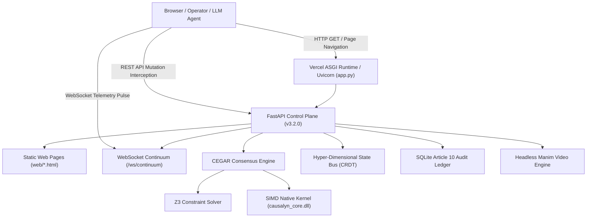

# Causalyn Web Architecture & Control Plane Specification
*Authoritative System Reference for Human Engineers and Autonomous LLM Agents*
*Governed by Epoch-V / VPSN Agent Operating System & EU AI Act (Regulation 2024/1689 Article 10)*

---

## 1. Executive Summary

Causalyn is a deterministic AI execution hypervisor that intercepts autonomous agent actions (shell executions, file mutations, database migrations, network egress) before they reach production host infrastructure. It gates actions through formal CEGAR (Counterexample-Guided Abstraction Refinement), declarative SMT-LIB v2 constraints (Z3), SIMD-accelerated Shannon entropy scans, and the continuous **Vaishak Continuum** metric tensor ($\kappa$).

The web interface is a high-frequency, glassmorphic real-time control plane ("Acausal Cockpit") connecting users, operators, and LLM swarms to the Causalyn Consensus Engine.

---

## 2. High-Level Architecture Diagram



---

## 3. Web Pages & DOM Structure Directory

The web application is pure Vanilla HTML5, CSS3 (Modern Glassmorphism & Luminous Pearl Aesthetic), and ES6+ JavaScript. It operates without external framework dependencies (zero React, Vue, or Tailwind bloat), ensuring sub-10ms initial paint times and 100% deterministic DOM predictability for automated browser agents.

### Summary Table of Routes & Files

| URL Path | Source File | Purpose | Primary Data Endpoints |
| :--- | :--- | :--- | :--- |
| `/` or `/cockpit` | [`web/index.html`](file:///E:/BrosKi/causalyn/web/index.html) | Main Acausal Control Plane & Cockpit | `/api/v1/intercept`, `/api/v1/telemetry/quantitative`, `/ws/continuum` |
| `/overview` | [`web/overview.html`](file:///E:/BrosKi/causalyn/web/overview.html) | Executive & Architectural Overview | `/api/health`, `/api/state` |
| `/invariants` | [`web/invariants.html`](file:///E:/BrosKi/causalyn/web/invariants.html) | Declarative Invariant Rule Manager | `GET /api/v1/invariants`, `POST /api/v1/invariants`, `PATCH .../toggle` |
| `/proofs` | [`web/proofs.html`](file:///E:/BrosKi/causalyn/web/proofs.html) | Mathematical Proofs & Manim Visualizer | `/docs/The_Vaishak_Principle_Illustrated.pdf`, Manim video stream |
| `/audit` | [`web/audit.html`](file:///E:/BrosKi/causalyn/web/audit.html) | Article 10 Immutable Audit Ledger | `GET /api/audit`, `GET /api/pipelines` |
| `/swarm` | [`web/swarm.html`](file:///E:/BrosKi/causalyn/web/swarm.html) | Hyper-Dimensional CRDT State Bus & Swarm | `POST /api/v1/swarm/reconcile`, `/ws/continuum` |

---

### Page 1: Main Control Plane Cockpit (`/` or `/cockpit`)
- **File**: [`web/index.html`](file:///E:/BrosKi/causalyn/web/index.html)
- **Controller**: [`web/js/cockpit.js`](file:///E:/BrosKi/causalyn/web/js/cockpit.js), [`web/vaishak_canvas.js`](file:///E:/BrosKi/causalyn/web/vaishak_canvas.js)
- **Key Interactive Elements & DOM Selectors**:
  - `#vaishak-canvas`: Three.js WebGL canvas rendering the dynamic 3D Riemannian manifold $z = \sin(u)\cos(v) + \kappa e^{-(u^2+v^2)}$. Rotates and deforms in real-time based on live paradox spikes.
  - `#metric-kappa`: Primary numerical display of the Paradox Index $\kappa \in [0, \infty)$. Transitions color dynamically:
    - $\kappa = 0.000$: Vivid Indigo (`#4F46E5`) — Semantic Null-Space Equilibrium.
    - $\kappa > 0.000$: Vibrant Crimson (`#E11D48`) — Destructive Semantic Interference.
  - `#badge-consensus`: Pill indicator showing current hypervisor state (`EQUILIBRIUM`, `VERIFYING`, or `ANNIHILATED`).
  - `#telemetry-grid`: Quantitative metrics container:
    - `#stat-latency`: AST synthesis latency in microseconds ($\mu s$).
    - `#stat-tokens`: LLM context tokens conserved by preventing crash tracebacks.
    - `#stat-crashes`: Integer count of averted fatal exceptions.
  - `#prompt-dispatch-input`: Text input for entering natural language mutation intents or autonomous prompts.
  - `#btn-dispatch`: Triggers `POST /api/v1/prompt/dispatch`.
  - `#btn-simulate-safe`: Triggers mock benign mutation (`kappa = 0.0`).
  - `#btn-simulate-hazard`: Triggers mock adversarial mutation with injected drop table / secret leak (`kappa = 999.0`).
  - `#btn-export-cert`: Triggers download of formal verification audit PDF from `/api/v1/compliance/certificate.pdf`.
  - `#drawer-thoughts`: Slide-out panel displaying live thought token stream from reasoning models.

---

### Page 2: Architectural Overview (`/overview`)
- **File**: [`web/overview.html`](file:///E:/BrosKi/causalyn/web/overview.html)
- **Purpose**: Provides deep narrative context on the Vaishak Principle of Semantic Nullification (VPSN), explaining how autonomous multi-agent systems diverge into failure loops without constraint-gated shadow execution.
- **Key Sections**:
  - `section.overview-hero`: Core mission statement and dual quantitative telemetry rationale.
  - `section.three-layer-model`: Layer 1 (Interception Hook), Layer 2 (Consensus Engine), Layer 3 (Commit Boundary).
  - `section.mathematical-formulation`: Formal definition of semantic nullification and continuous curvature evolution.

---

### Page 3: Invariant Matrix Manager (`/invariants`)
- **File**: [`web/invariants.html`](file:///E:/BrosKi/causalyn/web/invariants.html)
- **Controller**: Script block inside [`web/invariants.html`](file:///E:/BrosKi/causalyn/web/invariants.html#L210-L350)
- **Key Elements**:
  - `#invariants-table-body`: Renders active and inactive invariant rules fetched via `GET /api/v1/invariants`.
  - `.toggle-switch[data-id]`: Clickable slider toggle that immediately sends `PATCH /api/v1/invariants/{id}/toggle` to enable/disable specific mathematical boundaries.
  - `.btn-delete[data-id]`: Sends `DELETE /api/v1/invariants/{id}` to excise rules.
  - `#form-new-invariant`: Dynamic form to declare custom invariants:
    - Inputs: `#inv-name`, `#inv-type` (`numerical`, `semantic`, `path`, `regex`), `#inv-threshold`, `#inv-operator`, `#inv-pattern`.
    - Submission sends `POST /api/v1/invariants`.

---

### Page 4: Mathematical Proofs & Manim Visualizer (`/proofs`)
- **File**: [`web/proofs.html`](file:///E:/BrosKi/causalyn/web/proofs.html)
- **Purpose**: Academic and mathematical verification cockpit.
- **Key Elements**:
  - `div.proof-theorem-box`: LaTeX-rendered representation of **Theorem 1 (Semantic Nullification Equivalence)**.
  - `div.math-tensor-card`: Explicit formulas for:
    $$\kappa(t) = \|\nabla I\| \cdot (1 - \tanh(c_s \cdot c_c)) \cdot \frac{1}{1 + 0.05 t}$$
  - `#manim-video-player`: HTML5 video element loaded dynamically with base64-encoded pre-rendered or real-time Manim scenes.
  - `#btn-download-whitepaper`: Clickable link directly serving [`docs/The_Vaishak_Principle_Illustrated.pdf`](file:///E:/BrosKi/causalyn/docs/The_Vaishak_Principle_Illustrated.pdf).

---

### Page 5: Article 10 Audit Ledger (`/audit`)
- **File**: [`web/audit.html`](file:///E:/BrosKi/causalyn/web/audit.html)
- **Purpose**: Real-time compliance view satisfying EU AI Act (Regulation 2024/1689 Article 10) and SOC2 Type II audit trail requirements.
- **Key Elements**:
  - `#audit-table`: Displays chronologically ordered cryptographic records:
    - Columns: Mission ID, Timestamp, Target Path, Agent Model, Paradox Index ($\kappa$), Decision (`COMMITTED` / `ANNIHILATED`), Merkle Hash.
  - `#audit-summary-cards`: Displays aggregate metrics (Total Missions, Mean Paradox Index, Invariant Enforcement Rate = 100%).
  - `#btn-export-evidence`: Exports full JSON evidence pack for regulatory compliance auditors.

---

### Page 6: Hyper-Dimensional CRDT Swarm Bus (`/swarm`)
- **File**: [`web/swarm.html`](file:///E:/BrosKi/causalyn/web/swarm.html)
- **Purpose**: Visualizes distributed multi-agent operations coordinated through CRDT (Conflict-free Replicated Data Type) Lamport vector clocks.
- **Key Elements**:
  - `#swarm-agent-grid`: Cards representing active autonomous agents (e.g. `claude-3-5-sonnet`, `gemini-3.6-flash`, `gpt-4o`).
  - `#vector-clock-log`: Live scrollable stream of Lamport timestamps and concurrent mutation operations.
  - `#btn-reconcile-swarm`: Sends `POST /api/v1/swarm/reconcile` to trigger state convergence.

---

## 4. REST API & WebSocket Protocol Contract

All API routes are served by the top-level FastAPI instance in [`app.py`](file:///E:/BrosKi/causalyn/app.py) (and [`backend/app.py`](file:///E:/BrosKi/causalyn/backend/app.py)).

### 4.1 REST Endpoints Reference

#### `POST /api/v1/intercept`
Evaluates a candidate agent mutation against the SMT Z3 engine and semantic invariants.
- **Request Body**:
  ```json
  {
    "agent_id": "claude-3-5-sonnet",
    "target_file": "/app/services/worker.py",
    "proposed_content": "def process(): return True",
    "state_variables": { "threads": 8, "sockets": 42 }
  }
  ```
- **Response (`200 OK`)**:
  ```json
  {
    "type": "paradox_spike",
    "timestamp": 1788859052.12,
    "agent_id": "claude-3-5-sonnet",
    "target_file": "/app/services/worker.py",
    "vector_clock": { "claude-3-5-sonnet": 1 },
    "kappa": 0.0,
    "status": "COMMITTED",
    "latency_us": 44.02,
    "patch": null,
    "proposed_state": { "threads": 8, "sockets": 42 },
    "synthesized_code": null,
    "violated_invariants": []
  }
  ```

#### `GET /api/v1/invariants`
Returns all active declarative SMT invariants and semantic rules.
- **Response (`200 OK`)**:
  ```json
  {
    "status": "success",
    "total_invariants": 6,
    "invariants": [
      {
        "id": "INV-001-THREADS",
        "name": "Worker Concurrency Ceiling",
        "kind": "numerical",
        "target_var": "threads",
        "operator": "<=",
        "threshold": 16,
        "enabled": true
      },
      {
        "id": "INV-002-NO-DB-DROP",
        "name": "Destructive SQL Nullification Guard",
        "kind": "semantic",
        "pattern": "DROP TABLE|DROP DATABASE|TRUNCATE",
        "enabled": true
      }
    ]
  }
  ```

#### `PATCH /api/v1/invariants/{inv_id}/toggle`
Toggles an invariant rule between enabled and disabled.
- **Response (`200 OK`)**:
  ```json
  {
    "status": "success",
    "invariant_id": "INV-001-THREADS",
    "enabled": false
  }
  ```

#### `GET /api/v1/telemetry/quantitative`
Returns real-time quantitative engineering telemetry.
- **Response (`200 OK`)**:
  ```json
  {
    "status": "online",
    "active_agents": 3,
    "vector_clocks": { "claude-3-5-sonnet": 42, "gemini-3.6-flash": 18 },
    "latest_latency_us": 44.02,
    "total_tokens_conserved": 185420,
    "total_avoided_crashes": 14,
    "p50_latency_ms": 0.044,
    "p95_latency_ms": 0.128,
    "current_kappa": 0.0
  }
  ```

#### `GET /api/v1/compliance/certificate.pdf`
Compiles and streams the deterministic verification certificate PDF with formal LaTeX proofs and Merkle tree root.
- **Headers**: `Content-Type: application/pdf`, `Content-Disposition: inline; filename="audit.pdf"`

#### `POST /api/v1/prompt/dispatch`
Accepts natural language prompts and streams thought token callbacks to WebSocket listeners.
- **Request Body**:
  ```json
  {
    "prompt": "Increase thread concurrency to 32 and update database schema",
    "model": "claude-3-5-sonnet",
    "target_file": "/app/services/worker.py"
  }
  ```

---

### 4.2 WebSocket Continuum Protocol (`/ws/continuum`)

The client cockpit connects via `ws://127.0.0.1:8000/ws/continuum` (or `wss://<domain>/ws/continuum`).

#### Frame 1: Connection Acknowledgement (`connection_ack`)
Sent by server immediately upon connection:
```json
{
  "type": "connection_ack",
  "message": "Causalyn Acausal Continuum Online (Luminous Mode)",
  "vector_clocks": { "sys": 1 }
}
```

#### Frame 2: Paradox Spike Event (`paradox_spike`)
Emitted on every candidate mutation:
```json
{
  "type": "paradox_spike",
  "timestamp": 1788859052.12,
  "agent_id": "claude-3-5-sonnet",
  "target_file": "/app/services/worker.py",
  "kappa": 999.0,
  "status": "ANNIHILATED",
  "latency_us": 52.1,
  "patch": {
    "annihilated": true,
    "violations": ["NON_NEGOTIABLE_DESCRIPTOR_EXHAUSTION (sockets > 200)"]
  }
}
```

#### Frame 3: Thought Chunk Stream (`agent_thought_chunk`)
Streamed token-by-token during agent reflection:
```json
{
  "type": "agent_thought_chunk",
  "token": "Verifying",
  "chunk": "Verifying candidate thread limit against Z3 boundary...",
  "model": "claude-3-5-sonnet",
  "agent_id": "CLAUDE-3-5-SONNET-PLAYGROUND",
  "timestamp": 1788859052.45
}
```

#### Frame 4: 3D Manifold Update (`manifold_update`)
Pushed when 3D geometry needs deformation:
```json
{
  "type": "manifold_update",
  "kappa": 1.45,
  "agent_id": "claude-3-5-sonnet",
  "video_b64": "<base64_mp4_string>"
}
```

---

## 5. Styling System & Design Tokens

Causalyn implements the **Luminous Pearl & High-Contrast Glassmorphism** design system, defined in [`web/styles.css`](file:///E:/BrosKi/causalyn/web/styles.css) and [`web/css/glassmorphic_tokens.css`](file:///E:/BrosKi/causalyn/web/css/glassmorphic_tokens.css):

```css
:root {
  /* Surface & Background */
  --bg-primary: #F8FAFC;          /* Bright pearl base canvas */
  --bg-surface: rgba(255, 255, 255, 0.85); /* Glass card background */
  --border-subtle: rgba(226, 232, 240, 0.8);
  
  /* Primary Semantic Palette */
  --color-indigo: #4F46E5;        /* Safe Equilibrium state */
  --color-indigo-glow: rgba(79, 70, 229, 0.25);
  --color-crimson: #E11D48;       /* Paradox Violation state */
  --color-crimson-glow: rgba(225, 29, 72, 0.35);
  --color-emerald: #10B981;       /* Committed / Verified */
  --color-amber: #F59E0B;         /* Warnings & Pending */

  /* Typography */
  --font-sans: 'Inter', -apple-system, BlinkMacSystemFont, 'Segoe UI', Roboto, sans-serif;
  --font-mono: 'JetBrains Mono', 'Fira Code', monospace;

  /* Elevation & Glass Effect */
  --glass-blur: blur(16px);
  --shadow-card: 0 10px 30px -5px rgba(0, 0, 0, 0.05), 0 4px 12px -2px rgba(0, 0, 0, 0.025);
  --shadow-glow: 0 0 25px var(--color-indigo-glow);
}
```

---

## 6. Vercel & Cloud Deployment Guide

### Why Vercel Showed `Error: Found app.py but it does not define a top-level "app" FastAPI instance`
1. Vercel's Python Serverless builder (`@vercel/python`) automatically inspects `app.py` in the root of the project.
2. In the initial prototype, the application instance was declared as `api = FastAPI(...)`. Vercel looks strictly for the module variable `app`.
3. **Resolution**:
   - In [`app.py`](file:///E:/BrosKi/causalyn/app.py):
     ```python
     api = FastAPI(title="Causalyn API", version="0.2.0")
     app = api  # Top-level ASGI FastAPI instance required by Vercel
     ```
   - In [`backend/app.py`](file:///E:/BrosKi/causalyn/backend/app.py):
     ```python
     app = FastAPI(title="Causalyn Acausal Control Plane", version="3.2.0-PLAYGROUND")
     api = app  # Backward-compatibility alias
     ```
   - Added [`vercel.json`](file:///E:/BrosKi/causalyn/vercel.json) in project root specifying `@vercel/python` builder and single-page routing rewrite to `app.py`.

---

## 7. Operational Instructions for LLM Agents

When an autonomous LLM agent interacts with Causalyn:

1. **Local Launch**: Run `./start.ps1` from PowerShell. It automatically selects the `.venv` Python interpreter with `uvicorn`, frees port 8000, and binds to `http://127.0.0.1:8000`.
2. **Deterministic Pre-flight Verification**: Run `python -m causalyn.cli verify .` to scan all Python AST trees, high-entropy tokens, and protected paths.
3. **Continuous CI Check**: Run `python -m causalyn.cli ci verify-pr --diff <path_to_diff>` to evaluate git diffs before creating or merging PRs.
4. **Browser Testing (Playwright / DevTools)**: Use unique element IDs listed in Section 3 (`#btn-dispatch`, `#prompt-dispatch-input`, `#metric-kappa`, etc.) to drive headless tests without brittle CSS selectors.
